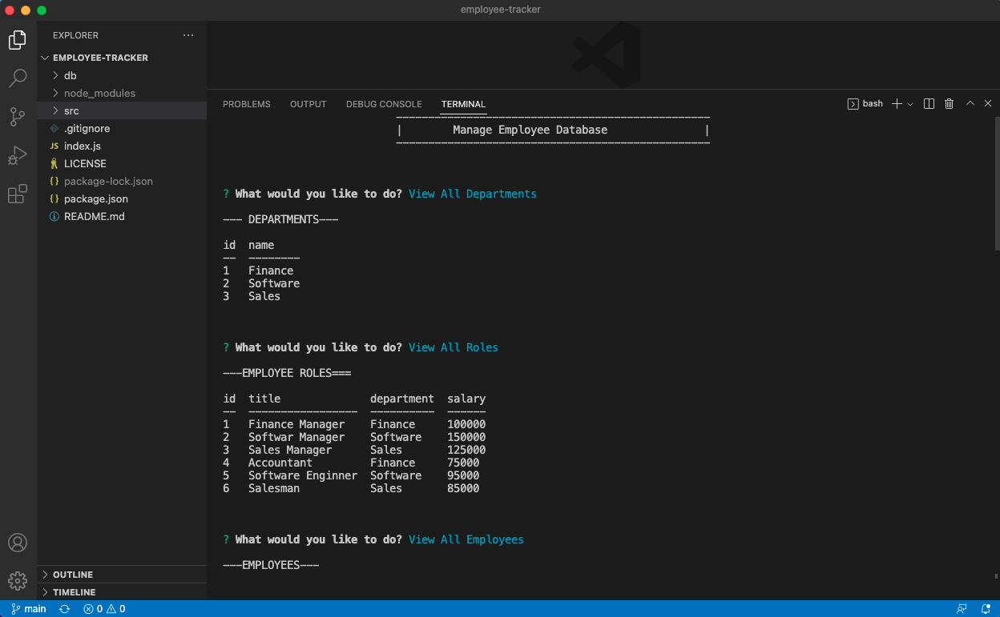
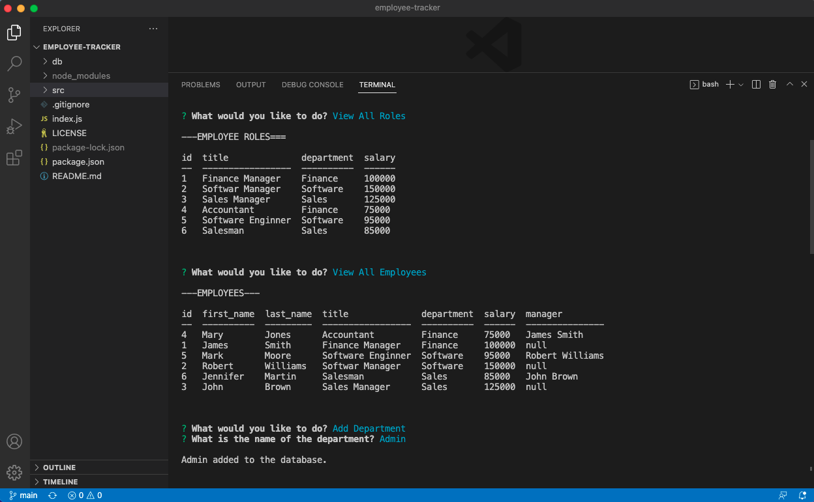

# Employee Tracker

## Description

This application is command-line application to manage a company's employee database using Node.js, Inquirer, and MySQL.

Video: [Employee Tracker](https://drive.google.com/file/d/1pYrQHDohtXySltrhxXGcaG4A1PXucKWJ/view?usp=share_link)

## Installation

Please run `npm i` to install dependencies.

## Usage

1. Run `source schema.sql` and `source seeds.sql` in mysql command line.

2. Run `npm start` in the command line to start the application.

## Credits

N/A

## Licence

Please refer to the LICENCE in the repo